# Tietokanta-tehtavat

# Yhteen tauluun kohdistuvat kyselyt

### Tehtävä 1
SELECT * FROM goal;
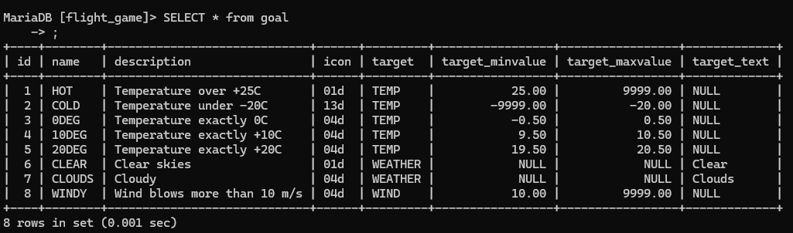

### Tehtävä 2
SELECT name airport_type FROM airport WHERE iso_country = "FI";
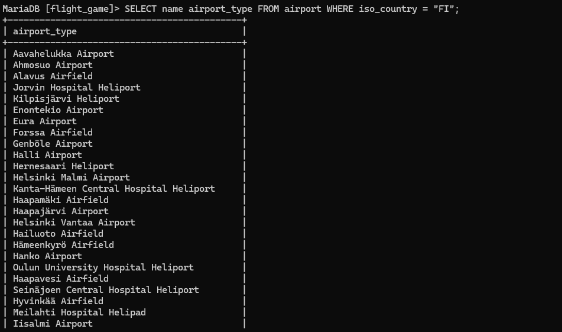

### Tehtävä 3
SELECT name FROM airport WHERE iso_country = "FI" ORDER BY name ASC;
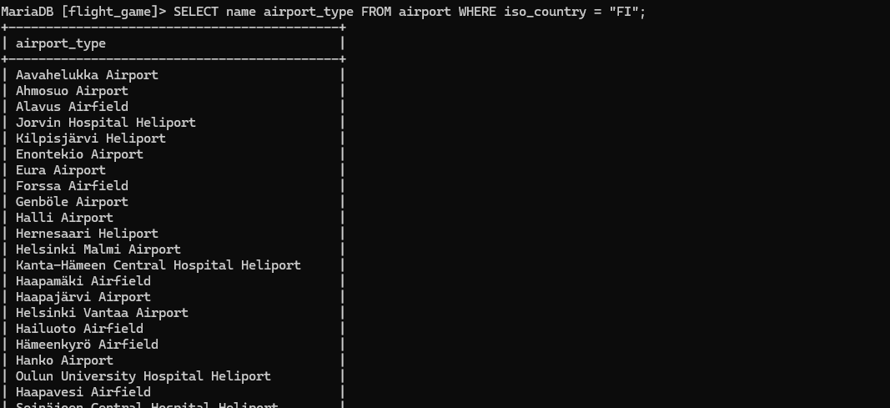

### Tehtävä 4
SELECT name, type FROM airport WHERE iso_country = "FI" ORDER BY type, name;

### Tehtävä 5
SELECT name FROM country WHERE name LIKE "F%";
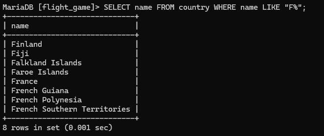

### Tehtävä 6
SELECT name FROM country WHERE name LIKE "%F%";
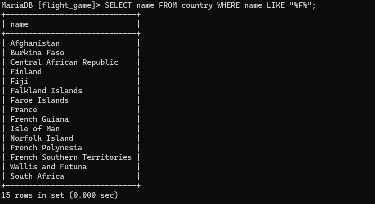

### Tehtävä 7
SELECT location FROM game WHERE screen_name = "Vesa";
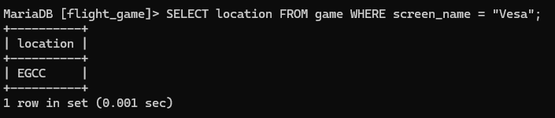

### Tehtävä 8
SELECT co2_consumed FROM game WHERE screen_name = "Ilkka";
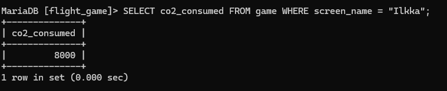

### Tehtävä 9
SELECT DISTINCT co2_budget FROM game;
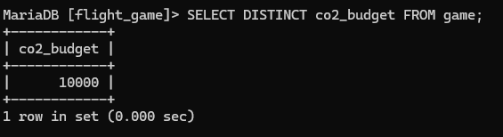

# Where-osan liitosehto

### Tehtävä 1
SELECT country.name AS "country name", airport.name AS "airport name" FROM airport, country WHERE airport.iso_country = country.iso_country AND country.name = "Iceland";
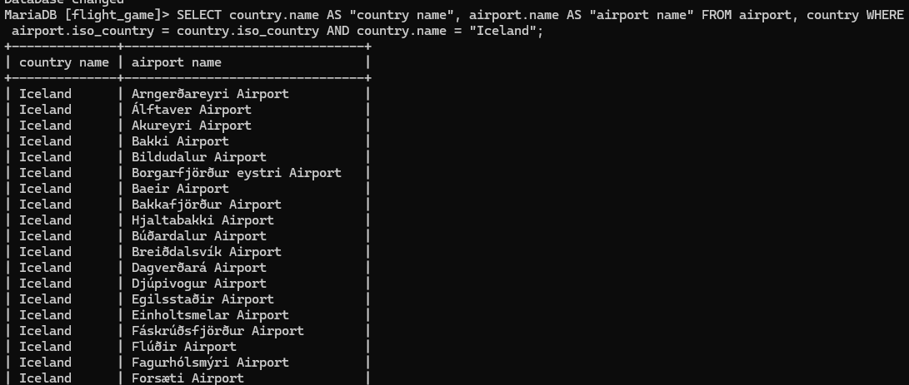

### Tehtävä 2
SELECT airport.name AS "airport name" FROM airport, country WHERE airport.iso_country = country.iso_country AND country.name = "France" AND airport.type = "large_airport";
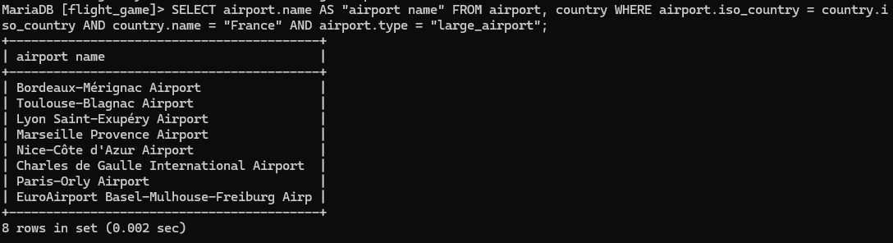

### Tehtävä 3
SELECT country.name AS country_name, airport.name AS airport_name FROM airport, country WHERE airport.iso_country = country.iso_country AND country.continent = "AN";
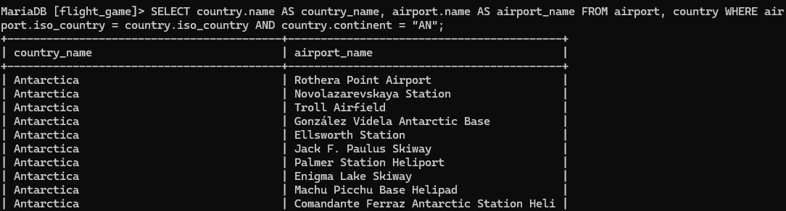

### Tehtävä 4
SELECT elevation_ft FROM airport, game WHERE location = ident AND screen_name = "Heini";
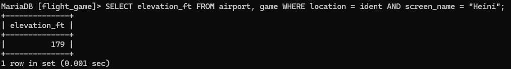

### Tehtävä 5
SELECT elevation_ft * 0.3048 AS elevation_m FROM airport, game WHERE location = ident AND screen_name = "Heini";
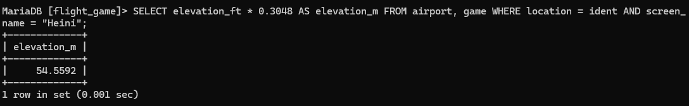

### Tehtävä 6
SELECT name FROM airport, game WHERE location = ident AND screen_name = "Ilkka";
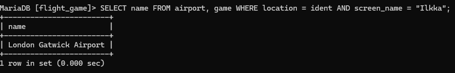

### Tehtävä 7
SELECT country.name FROM airport, game, country WHERE location = ident AND airport.iso_country = country.iso_country AND screen_name = "Ilkka";
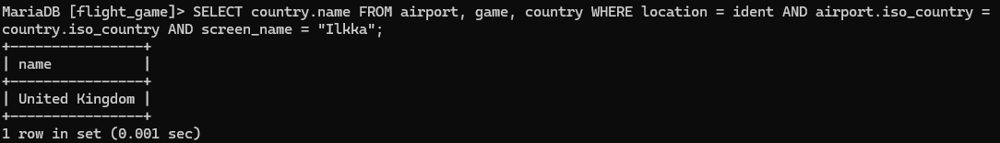

### Tehtävä 8
SELECT name FROM goal, goal_reached, game WHERE game.id = game_id AND goal.id = goal_id AND screen_name = "Heini";
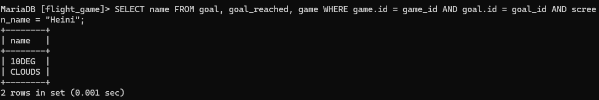

### Tehtävä 9
SELECT airport.name FROM airport, game, goal, goal_reached WHERE ident = location AND game.id = game_id AND goal.id = goal_id AND screen_name = "Ilkka" AND goal.name = "CLOUDS";
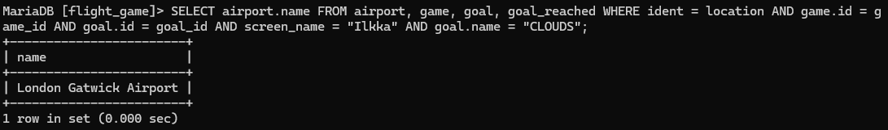

### Tehtävä 10
SELECT country.name FROM airport, country, game, goal, goal_reached WHERE ident = location AND airport.iso_country = country.iso_country AND game.id = game_id AND goal.id = goal_id AND screen_name = "Ilkka" AND goal.name = "CLOUDS";
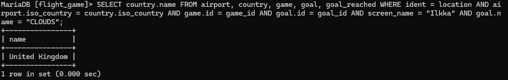