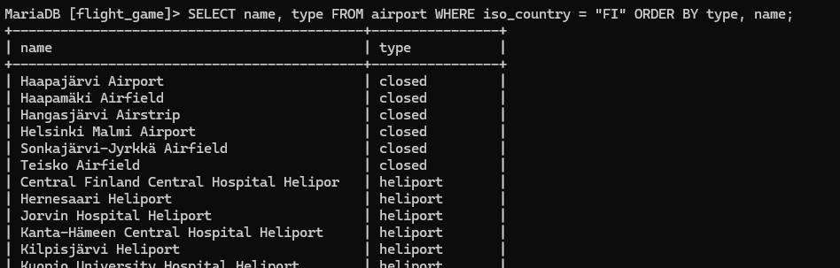
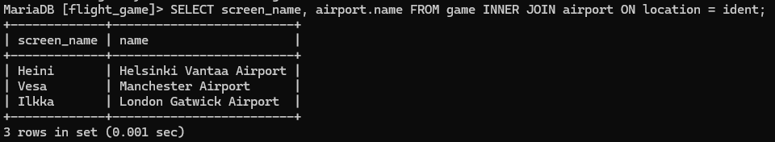

# Tietokanta-tehtavat

# Yhteen tauluun kohdistuvat kyselyt

### Tehtävä 1
SELECT * FROM goal;

### Tehtävä 2
SELECT name airport_type FROM airport WHERE iso_country = "FI";

### Tehtävä 3
SELECT name FROM airport WHERE iso_country = "FI" ORDER BY name ASC;

### Tehtävä 4
SELECT name, type FROM airport WHERE iso_country = "FI" ORDER BY type, name;

### Tehtävä 5
SELECT name FROM country WHERE name LIKE "F%";

### Tehtävä 6
SELECT name FROM country WHERE name LIKE "%F%";

### Tehtävä 7
SELECT location FROM game WHERE screen_name = "Vesa";

### Tehtävä 8
SELECT co2_consumed FROM game WHERE screen_name = "Ilkka";

### Tehtävä 9
SELECT DISTINCT co2_budget FROM game;

# Where-osan liitosehto

### Tehtävä 1
SELECT country.name AS "country name", airport.name AS "airport name" FROM airport, country WHERE airport.iso_country = country.iso_country AND country.name = "Iceland";

### Tehtävä 2
SELECT airport.name AS "airport name" FROM airport, country WHERE airport.iso_country = country.iso_country AND country.name = "France" AND airport.type = "large_airport";

### Tehtävä 3
SELECT country.name AS country_name, airport.name AS airport_name FROM airport, country WHERE airport.iso_country = country.iso_country AND country.continent = "AN";

### Tehtävä 4
SELECT elevation_ft FROM airport, game WHERE location = ident AND screen_name = "Heini";

### Tehtävä 5
SELECT elevation_ft * 0.3048 AS elevation_m FROM airport, game WHERE location = ident AND screen_name = "Heini";

### Tehtävä 6
SELECT name FROM airport, game WHERE location = ident AND screen_name = "Ilkka";

### Tehtävä 7
SELECT country.name FROM airport, game, country WHERE location = ident AND airport.iso_country = country.iso_country AND screen_name = "Ilkka";

### Tehtävä 8
SELECT name FROM goal, goal_reached, game WHERE game.id = game_id AND goal.id = goal_id AND screen_name = "Heini";

### Tehtävä 9
SELECT airport.name FROM airport, game, goal, goal_reached WHERE ident = location AND game.id = game_id AND goal.id = goal_id AND screen_name = "Ilkka" AND goal.name = "CLOUDS";

### Tehtävä 10
SELECT country.name FROM airport, country, game, goal, goal_reached WHERE ident = location AND airport.iso_country = country.iso_country AND game.id = game_id AND goal.id = goal_id AND screen_name = "Ilkka" AND goal.name = "CLOUDS";

# Join harjoitukset

### Tehtävä 1
SELECT country.name AS "country name", airport.name AS "airport name" FROM country INNER JOIN airport ON airport.iso_country = country.iso_country  WHERE country.name = "Finland" AND scheduled_service = "yes";

### Tehtävä 2
SELECT screen_name, airport.name FROM game INNER JOIN airport ON location = ident;

### Tehtävä 3
SELECT screen_name, country.name FROM game, airport INNER JOIN country ON location = ident WHERE airport.iso_country = country.iso_country;

### Tehtävä 4
SELECT airport.name, screen_name FROM airport LEFT JOIN game ON ident = location WHERE name like "%Hels%";

### Tehtävä 5
SELECT name, screen_name FROM goal LEFT JOIN goal_reached ON goal.id = goal_id LEFT JOIN game ON game.id = game_id;

# Sisäkysely harjoitukset

### Tehtävä 1
SELECT name FROM country WHERE iso_country IN(SELECT iso_country FROM airport WHERE name like "Satsuma%");

### Tehtävä 2
SELECT name FROM airport WHERE iso_country IN(SELECT iso_country FROM country WHERE name = "Monaco");

### Tehtävä 3
SELECT screen_name FROM game WHERE id IN(SELECT game_id FROM goal_reached WHERE goal_id IN(SELECT id FROM goal WHERE name = "CLOUDS"));

### Tehtävä 4
SELECT country.name FROM country WHERE iso_country NOT IN(SELECT airport.iso_country FROM airport);

### Tehtävä 5
SELECT name FROM goal WHERE id NOT IN(SELECT goal.id FROM goal, goal_reached, game WHERE game.id = game_id AND goal.id = goal_id AND screen_name = "Heini");

# Koostetieto kyselyt 

### Tehtävä 1
SELECT max(elevation_ft) FROM airport;

### Tehtävä 2
SELECT continent, count(*) FROM country GROUP BY continent;

### Tehtävä 3
SELECT screen_name, count(*) FROM game, goal_reached WHERE id = game_id GROUP BY screen_name;

### Tehtävä 4
SELECT screen_name FROM game WHERE co2_consumed IN(SELECT min(co2_consumed) FROM game);

### Tehtävä 5
SELECT country.name, count(*) FROM airport, country WHERE airport.iso_country = country.iso_country GROUP BY country.iso_country ORDER BY count(*)DESC LIMIT 50;

### Tehtävä 6
SELECT country.name FROM airport, country WHERE airport.iso_country = country.iso_country GROUP BY country.iso_country HAVING count(*)>1000;

### Tehtävä 7
SELECT name FROM airport WHERE elevation_ft IN (SELECT max(elevation_ft) FROM airport);

### Tehtävä 8
SELECT name FROM country WHERE iso_country IN (SELECT iso_country FROM airport WHERE elevation_ft IN (SELECT max(elevation_ft) FROM airport));

### Tehtävä 9
SELECT count(*) FROM game, goal_reached WHERE id = game_id AND screen_name = "Vesa" GROUP BY screen_name;

### Tehtävä 10
SELECT name FROM airport WHERE latitude_deg IN (SELECT min(latitude_deg) FROM airport);

# Päivityskyselyt

### Tehtävä 1
UPDATE game SET location = (SELECT ident FROM airport WHERE name = "Nottingham Airport"), co2_consumed = co2_consumed+500 WHERE screen_name = "Vesa";

### Tehtävä 3
DELETE FROM goal_reached;
SELECT * FROM goal_reached;

### Tehtävä 4
DELETE FROM game;
SELECT * FROM game;

# Tietokannan suunnittelu tehavat

